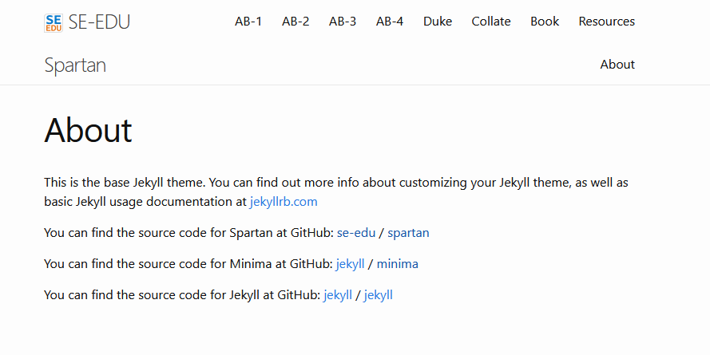

# Spartan

*Spartan is a minimal theme for software documentation optimized for use as a remote GitHub pages remote theme*



## Usage

Add this line to your site's `_config.yml`:

```
remote_theme: se-edu/spartan
```

## Contributing

Bug reports and pull requests are welcome on GitHub at https://github.com/se-edu/spartan. 

## License

The theme is available as open source under the terms of the [MIT License](http://opensource.org/licenses/MIT).
